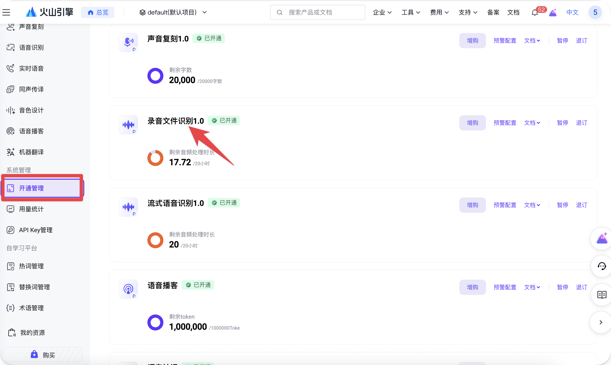
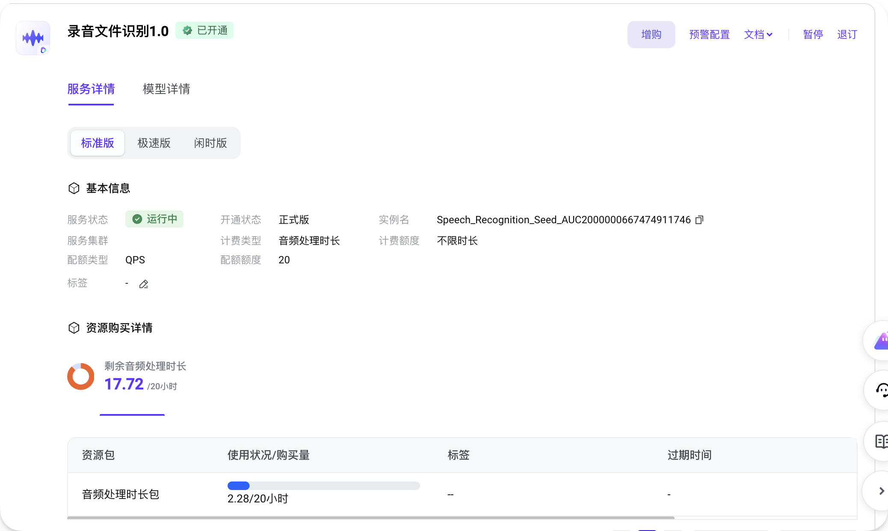
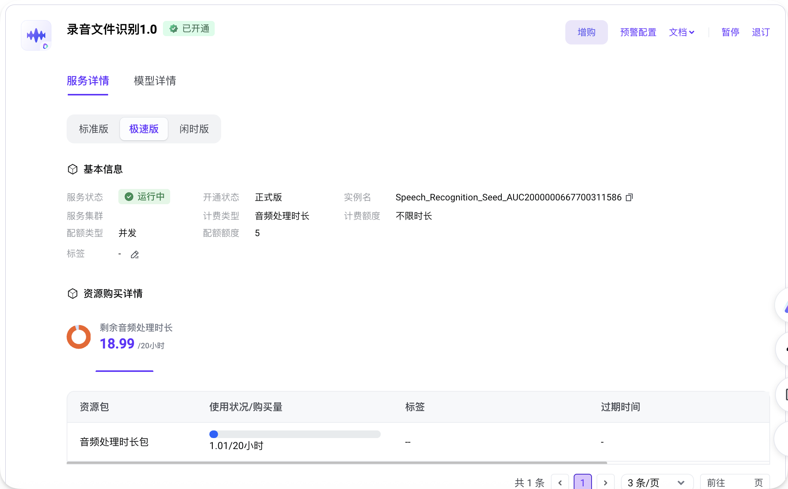
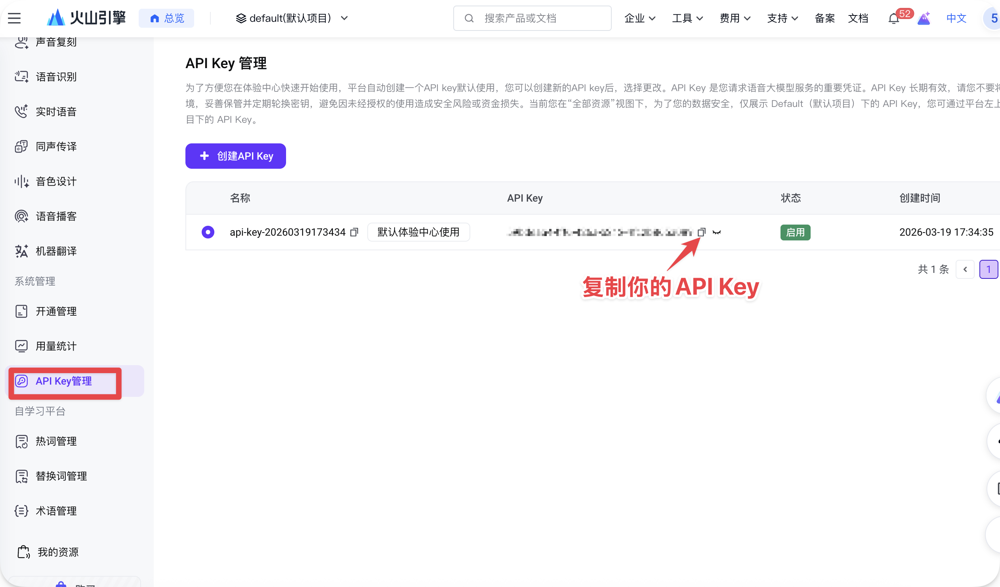

# AI剪口播

一个**剪口播视频的 coding-agent skill**:自动转录 → AI 识别口误/口癖/静音 → 网页波形审核 → 导出 FCPXML,拖进剪映或 Final Cut Pro 完成最后一刀。核心是一份 [`SKILL.md`](SKILL.md),**任何支持 skill、能读文件、能跑 shell 的 coding agent 都能装来用**,不绑定特定工具。
> 这个项目灵感最初来源于GitHub开源项目 videocut-skills，为了适配我自己的剪辑工作流，重写和扩展了工程导出、前端交互、视频预览、核心剪辑逻辑、语音识别和音频识别字幕等功能


> 审核网页:左侧逐字稿点划即删,右侧调静音留白,底部三色波形(灰=静音、红=选中删除、黄=算法额外切掉)。改到满意点「导出 FCPXML」。

## 这个 Skill 做什么

口播视频最费时的不是剪,是**找哪里该删** —— 重复重说、卡顿、口癖、长停顿。AI剪口播 把这步交给 agent:转录全文、标出该删的片段,再起一个**本地审核网页**,让你在波形上一眼看清「真正会切到哪一帧」,所见即所得。

它**不直接剪视频**,只把「哪里该删」想清楚,生成剪辑工程文件(FCPXML)交给剪辑软件做最后一刀。无云端、无账号、无第三方图床 —— 音频直传火山引擎转录,剩下全在你本机跑。

### 主要特性

- **AI 预标口误** — 重复重说、残句、卡顿、纯语气词整句,自动选出来等你确认,不用自己逐句听
- **波形审核,所见即所得** — 本地网页上点划增删,三色波形实时显示真正会切到哪一帧,不漂移
- **剪映 / Final Cut Pro 通吃** — 导出 FCPXML 拖进去就还原时间线,不抢剪辑软件的活
- **越用越懂你** — 每次剪完可让它学习你的取舍,沉淀成个人规则,下次预标更准
- **全程本机、免费够用** — 视频不上云,转录走火山引擎免费额度(≈40h)

## 安装

把这个仓库地址发给你的 coding agent,说一句 **「装一下」**:

```text
https://github.com/lcbuaaliu/ai-jian-koubo
```

agent 会读 README,自己把它装到本地 skills 目录、配好环境、跑一遍自检,约 1 分钟。有文件系统权限的 agent 直接帮你装好;没有的话,也能在当前会话里照 [`SKILL.md`](SKILL.md) 直接跑一遍。

唯一需要你**亲自做**的一步:办一个**火山引擎 API Key**(语音转录用,共 **40h 免费额度**,完全够用)。装的时候 agent 会引导你把 key 填进去。

### 办火山引擎 API Key(约 2 分钟)

**1. 打开并登录[火山引擎 · 豆包语音服务](https://console.volcengine.com/speech/new/overview)控制台。**


**2. 点左侧「开通管理」→ 开通「录音文件识别 1.0」。标准版和极速版都开通**(各 20h、共 40h 免费额度,独立抵扣,完全够用)。



开通后在服务详情里能看到两个版本都是「已开通 · 运行中」:

| 标准版 | 极速版 |
|:---:|:---:|
|  |  |

**3. 点左侧「API Key 管理」,复制你的 API Key。**



**4. 把 key 发给 agent,它会帮你放到正确位置**(skill 目录下的 `.env`)。也可以自己设成环境变量(任何 agent、任何安装位置都认):

```bash
export VOLCENGINE_API_KEY=粘贴你的key
```

## 使用

把视频路径丢给 agent,它会先让你**选一个模式**:

```text
📹 视频:/path/to/视频.mp4
请选择模式:
  [A] 剪口播 — 识别口误 → 网页审核 → 导出 FCPXML 给剪映 / FCP
  [B] 转字幕 — 转录 → 输出规范字幕文本(markdown,无时间戳)
```

成品默认输出到 `~/Desktop/output/日期_视频名/` 下。

### 模式 A:剪口播(主线)

直接说「**帮我剪这个口播视频 /path/to/video.mp4**」,选 A。agent 会:

1. 抽音频 → 火山引擎转录成字级字幕
2. 通读全文,标出口误 / 口癖 / 残句,**预选**好要删的片段
3. 起一个**本地审核网页**,你在波形和逐字稿上增删、调起止留白
4. 满意后点 **「导出 FCPXML」**
5. 把生成的 `*_cut.fcpxml` 拖进剪辑软件,完成最终剪辑:
   - **剪映专业版**:文件 → 导入 → Final Cut Pro XML
   - **Final Cut Pro**:双击 `.fcpxml` 即导入

> 💡 剪完可以再说一句「**已导出,学一下**」。agent 会对比「AI 预选」和「你实际怎么剪」,把你的取舍习惯沉淀成个人规则,下次预标更贴近你的风格。

### 模式 B:转字幕

说「**把这个视频转成字幕**」,选 B。agent 会转录 → 纠错(同音错字、专有名词)→ 自然断行,输出一份规范的字幕文本 `subtitles_formatted.md`(简体中文、每行不长、无时间戳),可直接拿去用。

## 依赖要求

- 一个支持 skill、有文件系统访问、能跑 shell 命令的 coding agent(不绑定特定工具)
- `node` · `python3` · `ffmpeg` · `curl`(自检脚本 `doctor.js` 会按平台给安装命令)
- 一个[火山引擎](https://console.volcengine.com/speech/new/overview)账号(语音转录用,有免费额度)

想了解内部流程(步骤 0-8、两模式的脚本管线),看 [`SKILL.md`](SKILL.md) —— 它是整个 skill 的唯一入口和工作流地图。

## 隐私

`.env`(你的 key)被 `.gitignore` 忽略,不会进仓库。音频直传火山引擎转录,不经任何第三方图床。

## 致谢

由 **栗氪聊AI** 创建。

## License

[AGPL-3.0](LICENSE) — 自由使用、修改、分发；但**任何修改版都必须同样以 AGPL-3.0 开源，包括把它做成网页 / 在线服务对外提供时也要公开你的改动源码**。

Copyright © 2026 栗氪聊AI
