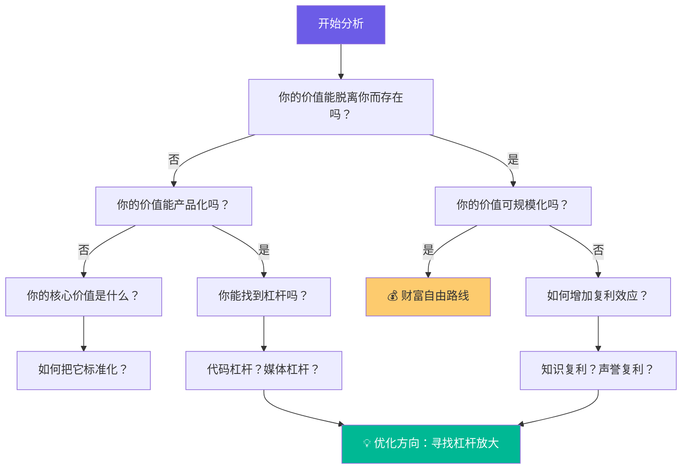
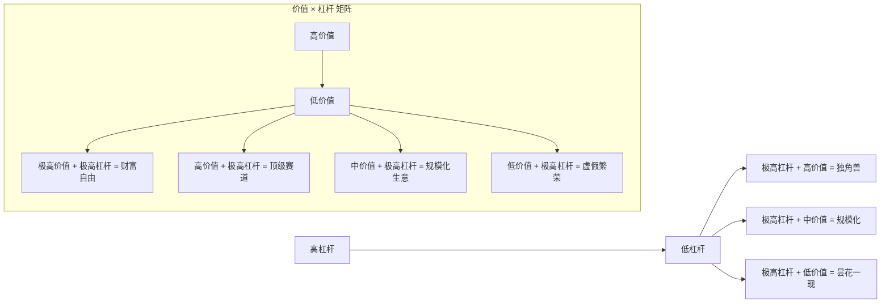
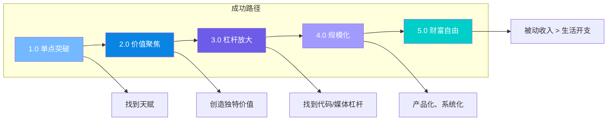

# 纳瓦尔财富方法论 - 思维导图

```mermaid
flowchart TB
    subgraph TOP["🚀 纳瓦尔财富方法论"]
        direction TB
        TOP1["财富 = 价值 × 杠杆"]
    end

    TOP --> STEP1["第一步：定位"]
    TOP --> STEP2["第二步：价值"]
    TOP --> STEP3["第三步：杠杆"]

    %% 第一步：定位
    STEP1 --> S1A["1.1 找到独特天赋"]
    STEP1 --> S1B["1.2 判断力培养"]
    STEP1 --> S1C["1.3 长期主义"]

    S1A --> S1A1["天赋矩阵"]
    S1A1 --> A["🎯 喜欢 + 难学 = 天赋技能 ★"]
    S1A1 --> B["📚 喜欢 + 易学 = 可培养爱好"]
    S1A1 --> C["😴 不喜欢 + 难学 = 苦差事"]
    S1A1 --> D["❌ 不喜欢 + 易学 = 无用技能"]

    S1B --> S1B1["判断力层级"]
    S1B1 --> B1["层级1：什么不能做"]
    S1B1 --> B2["层级2：5年后会怎样？"]
    S1B1 --> B3["层级3：本质是什么？"]

    S1C --> S1C1["长期 vs 短期"]
    S1C1 --> C1["长期：积累能力"]
    S1C1 --> C2["短期：立即变现"]

    %% 第二步：价值
    STEP2 --> S2A["2.1 特定知识"]
    STEP2 --> S2B["2.2 判断力输出"]
    STEP2 --> S2C["2.3 复利积累"]

    S2A --> S2A1["特定知识来源"]
    S2A1 --> K1["独特经历 ★★★★★"]
    S2A1 --> K2["技能组合 ★★★★☆"]
    S2A1 --> K3["地理位置 ★★★★☆"]
    S2A1 --> K4["关系网络 ★★★☆☆"]
    S2A1 --> K5["信息渠道 ★★★☆☆"]

    S2B --> S2B1["输出质量层级"]
    S2B1 --> O1["层级1：说得好"]
    S2B1 --> O2["层级2：写得好"]
    S2B1 --> O3["层级3：做得好"]
    S2B1 --> O4["层级4：教得好"]
    S2B1 --> O5["层级5：优化得好"]

    S2C --> S2C1["复利类型"]
    S2C1 --> L1["📖 知识复利"]
    S2C1 --> L2["🤝 人脉复利"]
    S2C1 --> L3["⭐ 声誉复利"]
    S2C1 --> L4["⚡ 技能复利"]
    S2C1 --> L5["💰 资产复利"]

    %% 第三步：杠杆
    STEP3 --> S3A["3.1 代码杠杆"]
    STEP3 --> S3B["3.2 媒体杠杆"]
    STEP3 --> S3C["3.3 资本杠杆"]
    STEP3 --> S3D["3.4 人力杠杆"]

    S3A --> LE1["🤖 AI工具"]
    S3A --> LE2["💻 软件/APP"]
    S3A --> LE3["⚙️ 自动化脚本"]
    S3A --> LE4["☁️ SaaS服务"]

    S3B --> LE5["📱 短视频 ★★★★★"]
    S3B --> LE6["✍️ 公众号/博客 ★★★★☆"]
    S3B --> LE7["🎙️ 播客 ★★★★☆"]
    S3B --> LE8["📚 书籍 ★★★★☆"]
    S3B --> LE9["👥 社群 ★★★☆☆"]

    S3C --> LE10["📈 投资理财"]
    S3C --> LE11["🤝 合伙投资"]
    S3C --> LE12["💎 股权融资"]

    S3D --> LE13["👤 外包"]
    S3D --> LE14["👥 团队"]
    S3D --> LE15["🏢 组织"]

    %% 剥离子弹
    TOP --> BULLET["💫 剥离子弹框架"]
    BULLET --> B1["可替代性排序"]
    B1 --> RANK["认知差 > 信息差 > 经验壁垒 > 资源壁垒 > 无壁垒"]
    RANK --> RR1["最难替代"]
    RANK --> RR2["最易替代"]

    BULLET --> B2["剥离路径"]
    B2 --> PATH1["阶段1：子弹在身体里"]
    B2 --> PATH2["阶段2：子弹部分剥离"]
    B2 --> PATH3["阶段3：子弹完全剥离"]

    style TOP fill:#ff6b6b,color:#fff
    style STEP1 fill:#4ecdc4,color:#fff
    style STEP2 fill:#45b7d1,color:#fff
    style STEP3 fill:#96ceb4,color:#fff
    style BULLET fill:#ffeaa7,color:#333
```

---

## 剥离子弹决策树

---

## 价值-杠杆矩阵

---

## 行动路线图

---

## 诊断清单速查

### 定位诊断
- [ ] 我做的事是我天赋所在吗？
- [ ] 我有清晰的决策标准吗？
- [ ] 我在积累什么？

### 价值诊断
- [ ] 我有什么独特知识？
- [ ] 我的价值能被产品化吗？
- [ ] 我在建立复利吗？

### 杠杆诊断
- [ ] 我有多少可用杠杆？
- [ ] 我的内容有杠杆效应吗？
- [ ] 我在建立资产还是消耗时间？

### 子弹剥离诊断
- [ ] 休息一个月收入归零吗？
- [ ] 客户能离开我吗？
- [ ] 我在建立系统吗？
